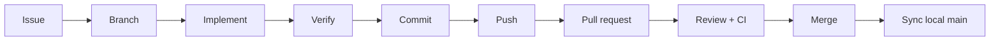

# Workflow — Issue-Driven Development

nene2-node tracks all implementation and policy work through **GitHub Issues**. Code reaches `main` only via reviewed pull requests linked to an Issue.

**Related docs:** `docs/CONTRIBUTING.md`, `docs/development/commit-conventions.md`, `docs/development/self-review.md`, `docs/todo/current.md`

## Principles

| Rule                 | Meaning                                                                                           |
| -------------------- | ------------------------------------------------------------------------------------------------- |
| **Issue first**      | No drive-by commits on `main`. Every change traces to an Issue (new or existing).                 |
| **One focus per PR** | One Issue → one branch → one PR → one merge (unless an Issue explicitly spans coordinated repos). |
| **Small diffs**      | Smallest change that satisfies the Issue; split follow-ups into new Issues.                       |
| **Recorded state**   | Decisions live in `docs/`, ADRs, and Issues — not only in chat.                                   |
| **Verified merge**   | CI green + self-review + reviewer approval before merge.                                          |

Do **not** push directly to `main` (branch protection is the target state on GitHub).

## Lifecycle overview



| Step | Action                        | Artifact                     |
| ---- | ----------------------------- | ---------------------------- |
| 1    | Open or reuse Issue           | GitHub Issue                 |
| 2    | Branch from `main`            | `type/issue-number-summary`  |
| 3    | Implement + update docs       | Code / `docs/`               |
| 4    | Self-review + `npm run check` | Checklist names in PR        |
| 5    | Commit                        | Conventional Commit + `(#N)` |
| 6    | Push branch                   | Remote branch                |
| 7    | Open PR                       | Linked to Issue              |
| 8    | Review + CI                   | Green checks                 |
| 9    | Merge PR                      | `main` updated               |
| 10   | Sync local                    | Clean `main`                 |

---

## 1. Issue

### When to open an Issue

- New feature, bug fix, refactor, test, CI, or **policy doc** change.
- Work that touches public HTTP behavior → often **NENE2 Issue first** for OpenAPI, then nene2-node (see `docs/scope.md`).
- Before an AI agent or contributor starts non-trivial implementation.

### When to reuse an Issue

- The scope matches an open Issue exactly.
- A follow-up is explicitly listed in the Issue or milestone.

### Parent vs per-FT Issues

- **[#29](https://github.com/hideyukiMORI/nene2-node/issues/29)** tracks the FT2–100 **program** (backlog, batches).
- Each **completed FT or release** still gets its own Issue + branch `type/<issue>-summary` + PR (`Closes #N`).
- Field trial reports cite the **dedicated Issue** and optionally parent #29.

### Retroactive Issues (audit)

If work merged without an Issue, open one **after merge**, comment `Completed in PR #…`, close it, and comment on the PR (`Retroactive tracking: closes #N`). Example mapping (2026-05-22): #47↔PR43, #48↔PR44, #49↔PR45, #50↔PR46, #51↔PR36.

### Issue content (minimum)

- **Title:** clear, English, actionable (e.g. `feat: add GET /health with contract test`).
- **Body:**
  - **Goal** — what “done” means.
  - **Scope** — in / out (link `docs/scope.md` if boundary is unclear).
  - **Acceptance criteria** — checklist (tests, docs, OpenAPI path).
  - **References** — roadmap phase, ADR, NENE2/python paths if parity work.

### Templates

Use GitHub templates when applicable:

- `.github/ISSUE_TEMPLATE/feature_request.yml`
- `.github/ISSUE_TEMPLATE/bug_report.yml`

Create via CLI:

```bash
gh issue create --title "feat: add Problem Details factory" --body "$(cat <<'EOF'
## Goal
…

## Acceptance criteria
- [ ] …
EOF
)"
```

Note the Issue number (e.g. `#12`) for branch name and commits.

### Local alignment

After creating or picking an Issue, check:

- `docs/roadmap.md` — phase fits current direction.
- `docs/milestones/` — acceptance criteria if listed.
- `docs/todo/current.md` — update when starting or finishing handoff work.

---

## 2. Branch (対応の開始)

### Naming

```text
<type>/<issue-number>-<short-summary>
```

`<type>` matches Conventional Commits: `feat`, `fix`, `docs`, `refactor`, `test`, `build`, `ci`, `chore`.

Examples:

- `feat/12-health-endpoint`
- `docs/3-issue-driven-workflow`
- `fix/34-problem-details-status`

### Create branch

```bash
git fetch origin
git switch main
git pull origin main
git switch -c feat/12-health-endpoint
```

Rules:

- Branch from **up-to-date `main`**.
- One branch per Issue (do not mix unrelated Issues).
- Do not commit on `main`.

---

## 3. Implement (対応)

- Change only files required by the Issue.
- Update `docs/` when behavior, policy, roadmap, or handoff changes.
- Follow `docs/development/engineering-policy.md` and relevant `docs/review/*.md` checklists.
- For public endpoints: implement to match NENE2 OpenAPI; do not invent parallel shapes.

### Verification before commit

When `src/` or `tests/` change:

```bash
npm run check
```

Narrower runs are allowed during development; the PR must report what was run and `npm run check` before merge unless the Issue is docs-only.

---

## 4. Commit

### Message format

See `docs/development/commit-conventions.md`.

```text
<type>(<optional scope>): <description> (#<issue>)
```

Example:

```text
feat(http): add GET /health handler (#12)
```

### Commands

```bash
git add <paths>
git commit -m "$(cat <<'EOF'
feat(http): add GET /health handler (#12)

EOF
)"
```

Rules:

- **English** subject and body in this repository.
- Include `(#<issue>)` in the subject when an Issue exists.
- One logical change per commit when possible; avoid unrelated file dumps.
- Do not commit `.env`, secrets, or `node_modules/`.
- Commits happen **only when the user or task explicitly requests them** (agents: do not commit without approval unless end-to-end delivery was requested).

---

## 5. Push

```bash
git push -u origin HEAD
```

First push on a branch sets upstream with `-u`. Later pushes:

```bash
git push
```

If the remote branch diverged after review feedback:

```bash
git pull --rebase origin feat/12-health-endpoint
# resolve conflicts, then
git push
```

Do not force-push `main`. Force-push feature branches only when you own the branch and rebasing was agreed (avoid after others reviewed unless coordinated).

---

## 6. Pull request

### Open PR

Link the Issue in the title or body. Prefer auto-close:

```text
Closes #12
```

CLI example:

```bash
gh pr create --title "feat(http): add GET /health (#12)" --body "$(cat <<'EOF'
## Summary
- …

## Test plan
- [ ] `npm run check`

## Self-review
- backend-api
- openapi-contract

Closes #12
EOF
)"
```

### PR body (required sections)

| Section                | Content                                   |
| ---------------------- | ----------------------------------------- |
| **Summary**            | What changed and why (1–3 bullets).       |
| **Test plan**          | Commands run; checklist of manual checks. |
| **Self-review**        | Names of `docs/review/*.md` used.         |
| **Issue link**         | `Closes #N` or `Relates to #N`.           |
| **Risks / follow-ups** | Known gaps or new Issues to file.         |

### During review

- Address comments with new commits on the same branch (push updates the PR).
- Re-run `npm run check` after substantive changes.
- Keep PR scope aligned with the Issue; spin unrelated work into a new Issue.

---

## 7. Merge

### Preconditions

- Required CI checks pass (see `.github/workflows/ci.yml`).
- Review approval per repository settings.
- No unresolved blocking review comments.
- Issue acceptance criteria met.

### Merge method

Use **GitHub’s merge button** (or `gh pr merge`) after checks pass. Prefer **merge commit** or **squash** per team habit; document in the Issue if a release tag depends on history.

```bash
gh pr merge <number> --merge
# or
gh pr merge <number> --squash
```

Do **not**:

- Merge with failing CI.
- Tag releases from unmerged PR branches.
- Amend pushed commits unless hooks require it and amend rules are satisfied (see project git safety policy).

### After merge

```bash
git switch main
git pull origin main
git branch -d feat/12-health-endpoint
```

Update `docs/todo/current.md` when the Issue closes a tracked task.

---

## Exceptions (narrower scope)

Follow the user’s or Issue’s explicit scope when it says:

| Scope                         | Skip                    |
| ----------------------------- | ----------------------- |
| Investigation / question only | Commit, push, PR, merge |
| Docs preview without merge    | PR optional             |
| User says “no commit”         | Commit and below        |

Agents must not merge or push without explicit end-to-end delivery request.

---

## Cross-repository Issues

| Change                                             | Where to open Issue first   |
| -------------------------------------------------- | --------------------------- |
| New public JSON endpoint or Problem Details `type` | **NENE2** → then nene2-node |
| Node runtime matching existing OpenAPI             | **nene2-node**              |
| Typed HTTP client                                  | **nene2-js**                |
| ESLint/TS policy for Node only                     | **nene2-node**              |

Coordinate PRs across repos when a single feature needs contract + runtime + client; link PRs in bodies.

---

## AI agent checklist (end-to-end delivery)

When asked to complete work through merge:

1. [ ] Issue exists or was created; number recorded.
2. [ ] Branch `type/issue-number-summary` from current `main`.
3. [ ] Implementation matches Issue and `docs/scope.md`.
4. [ ] Relevant `docs/review/*.md` checked.
5. [ ] `npm run check` passed (if code changed).
6. [ ] Commit(s) with `(#issue)` in subject.
7. [ ] Branch pushed.
8. [ ] PR opened with Summary, Test plan, Self-review, `Closes #N`.
9. [ ] CI green; review addressed.
10. [ ] PR merged; local `main` pulled; `docs/todo/current.md` updated if needed.

See also `docs/integrations/ai-tools.md` and `AGENTS.md`.

## Local project memory

| File                   | Role                                 |
| ---------------------- | ------------------------------------ |
| `docs/roadmap.md`      | Phases and long-term direction       |
| `docs/milestones/`     | Medium goals and acceptance criteria |
| `docs/todo/current.md` | Current board and handoff            |
| `docs/adr/`            | Architecture decisions               |

Do not leave binding decisions only in chat or PR comments — promote them to `docs/` or ADRs when they affect future work.
